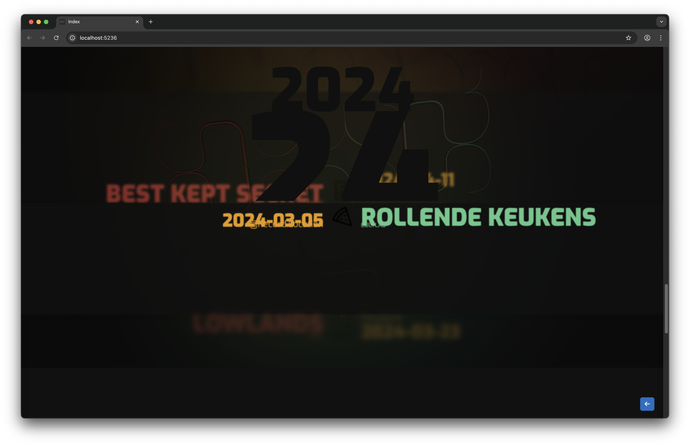
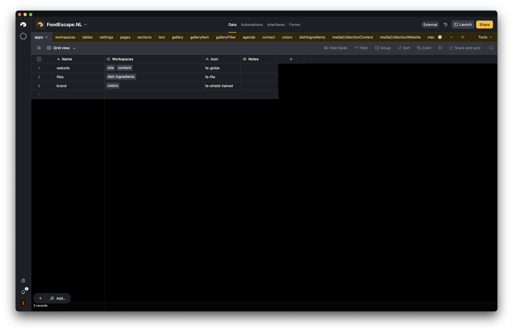
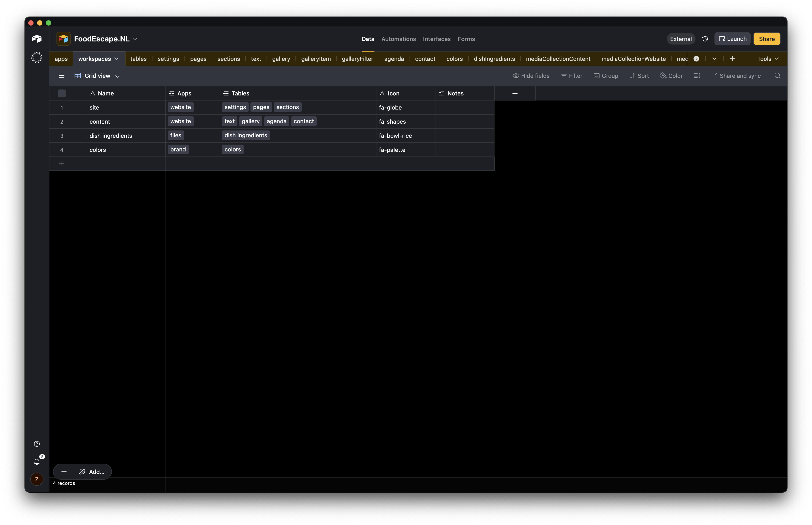
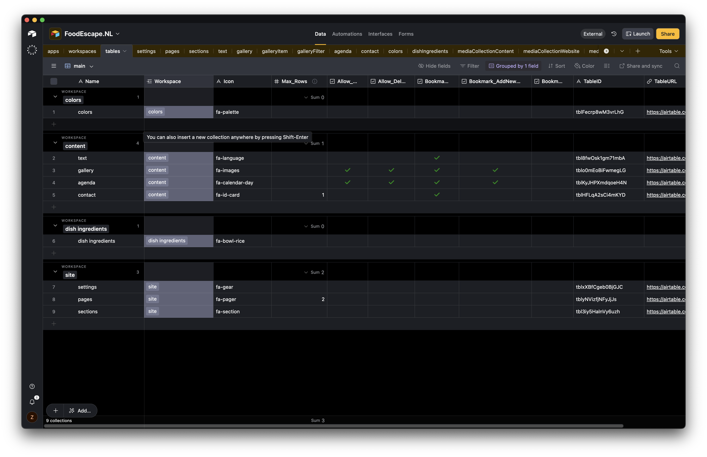
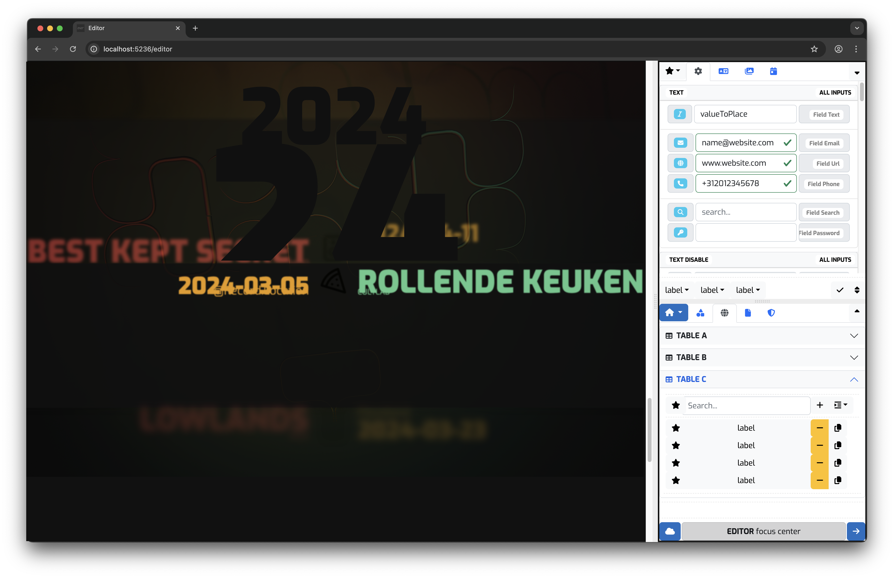
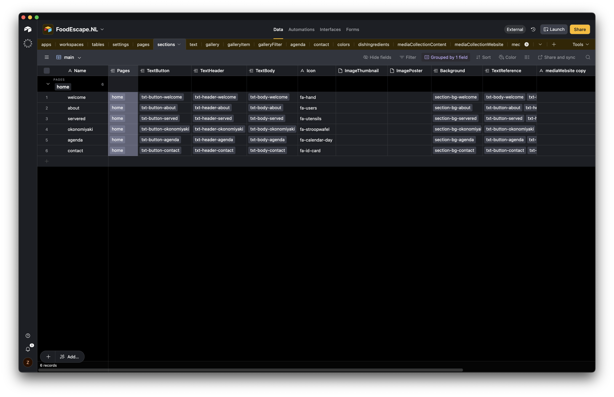
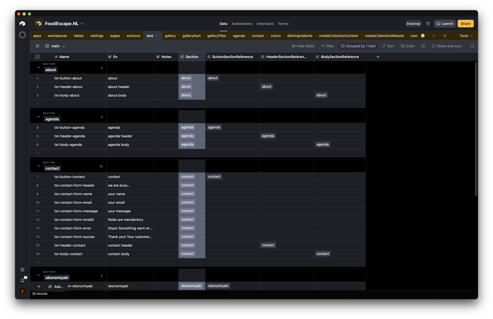
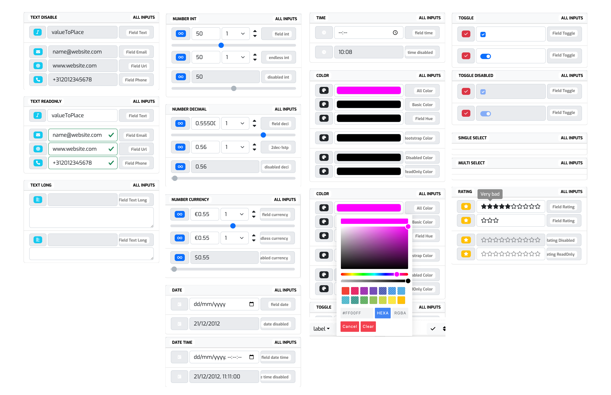
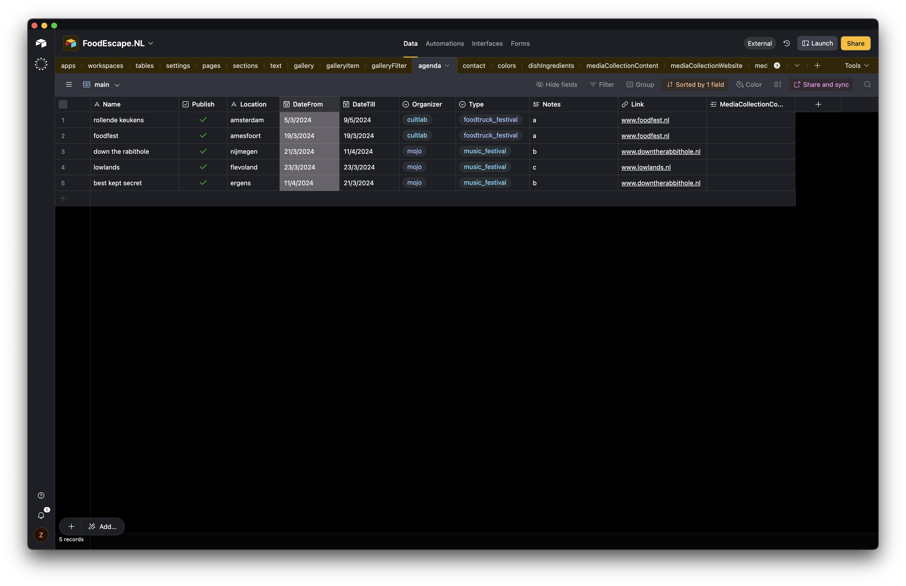
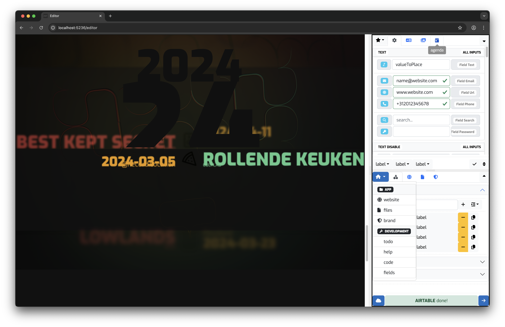

[← Back to Project Overview](../README.md)

---

# Data > UI

This document provides a visual introduction to how Airtable structures its data into bases, workspaces, tables, sections, and record content. The images below illustrate typical Airtable Editor UI, the cached JSON output and how those are used to drive the UI generation.

---

## Rendered Site

This is not a functional website, just a test to validate that airtable data is used to load text, images, video, iframe, spline3d etc.

the blue button in the bottom right corner is to open the editor as a side panel, and to show the content being updated in realtime (not functional yet)




---

## 1. Apps (Airtable Home)

This screenshot shows the top-level Apps overview inside Airtable.



```json
[{"id":"recakz8n6qNr0ERFB","createdTime":"2024-04-11T19:13:39Z","fields":{"Name":"website","Workspaces":["recOKKaScbPM76nBr","rectZAenVJrOQeYD4"],"Icon":"fa-globe","Notes":null},"commentCount":0},{"id":"reccHOXtHPOy96ZJ0","createdTime":"2024-04-11T19:13:39Z","fields":{"Name":"files","Workspaces":["recYZsav197g7e07a"],"Icon":"fa-file","Notes":null},"commentCount":0},{"id":"recx70dsPoqNRlG5f","createdTime":"2024-04-11T19:13:59Z","fields":{"Name":"brand","Workspaces":["recZHmviMuO169QDj"],"Icon":"fa-shield-halved","Notes":null},"commentCount":0}]
```


---

## 2. Workspaces

Workspaces help organize bases and applications. Each workspace may contain multiple bases used for different environments or teams.



```json
[{"id":"recOKKaScbPM76nBr","createdTime":"2024-04-30T15:48:08Z","fields":{"Name":"site","Apps":["recakz8n6qNr0ERFB"],"Tables":["rec7lExzqW5pjBzu5","recjUyVGNKMnef0LP","reciclYyae0eO5uqv"],"Icon":"fa-globe","Notes":null},"commentCount":0},{"id":"recYZsav197g7e07a","createdTime":"2024-04-30T15:49:32Z","fields":{"Name":"dish ingredients","Apps":["reccHOXtHPOy96ZJ0"],"Tables":["recR4XJya2NVoAKR8"],"Icon":"fa-bowl-rice","Notes":null},"commentCount":0},{"id":"recZHmviMuO169QDj","createdTime":"2024-04-30T15:49:32Z","fields":{"Name":"colors","Apps":["recx70dsPoqNRlG5f"],"Tables":["recZpHf3BIBxXlQ8S"],"Icon":"fa-palette","Notes":null},"commentCount":0},{"id":"rectZAenVJrOQeYD4","createdTime":"2024-04-30T15:48:16Z","fields":{"Name":"content","Apps":["recakz8n6qNr0ERFB"],"Tables":["recLSbH1G7kqM1qOX","recJW253kHMHuqXKs","recYI7QuY10J57fDW","recJYbSYzQtUXNHkC"],"Icon":"fa-shapes","Notes":null},"commentCount":0}]
```

---

## 3. Tables Inside a Base

A base contains multiple tables. Tables store structured data, similar to database tables or spreadsheets.



```json
[{"id":"rec7lExzqW5pjBzu5","createdTime":"2024-04-10T23:17:04Z","fields":{"Name":"settings","Workspace":["recOKKaScbPM76nBr"],"Icon":"fa-gear","Max_Rows":0,"Allow_Add":false,"Allow_Delete":false,"Bookmarked":false,"Bookmark_AddNewRow":false,"Bookmark_AllowRemoveFrom":false,"TableID":"tblxXBfCgeb0BjGJC","TableURL":"https://airtable.com/appw7gx55EkqWeWrs/tblxXBfCgeb0BjGJC/viwrYJxL7zdY78lB8?blocks=hide"},"commentCount":0},{"id":"recJW253kHMHuqXKs","createdTime":"2024-04-11T12:52:55Z","fields":{"Name":"gallery","Workspace":["rectZAenVJrOQeYD4"],"Icon":"fa-images","Max_Rows":0,"Allow_Add":true,"Allow_Delete":true,"Bookmarked":true,"Bookmark_AddNewRow":true,"Bookmark_AllowRemoveFrom":false,"TableID":"tblo0mEoBiFwmegLG","TableURL":"https://airtable.com/appw7gx55EkqWeWrs/tblo0mEoBiFwmegLG/viwPLG071tXpx7khg?blocks=hide"},"commentCount":0},{"id":"recJYbSYzQtUXNHkC","createdTime":"2024-04-10T23:10:34Z","fields":{"Name":"contact","Workspace":["rectZAenVJrOQeYD4"],"Icon":"fa-id-card","Max_Rows":1,"Allow_Add":false,"Allow_Delete":false,"Bookmarked":true,"Bookmark_AddNewRow":false,"Bookmark_AllowRemoveFrom":false,"TableID":"tblHFLqA2sCi4mKYD","TableURL":"https://airtable.com/appw7gx55EkqWeWrs/tblHFLqA2sCi4mKYD/viwW7TZLxpo6G83gA?blocks=hide"},"commentCount":0},{"id":"recLSbH1G7kqM1qOX","createdTime":"2024-04-11T12:52:35Z","fields":{"Name":"text","Workspace":["rectZAenVJrOQeYD4"],"Icon":"fa-language","Max_Rows":0,"Allow_Add":false,"Allow_Delete":false,"Bookmarked":true,"Bookmark_AddNewRow":false,"Bookmark_AllowRemoveFrom":false,"TableID":"tbl8fwOsk1gm71mbA","TableURL":"https://airtable.com/appw7gx55EkqWeWrs/tbl8fwOsk1gm71mbA/viwe9perdQRgg0CnU?blocks=hide"},"commentCount":0},{"id":"recR4XJya2NVoAKR8","createdTime":"2024-04-10T23:10:34Z","fields":{"Name":"dish ingredients","Workspace":["recYZsav197g7e07a"],"Icon":"fa-bowl-rice","Max_Rows":0,"Allow_Add":false,"Allow_Delete":false,"Bookmarked":false,"Bookmark_AddNewRow":false,"Bookmark_AllowRemoveFrom":false,"TableID":null,"TableURL":null},"commentCount":0},{"id":"recYI7QuY10J57fDW","createdTime":"2024-04-11T12:54:31Z","fields":{"Name":"agenda","Workspace":["rectZAenVJrOQeYD4"],"Icon":"fa-calendar-day","Max_Rows":0,"Allow_Add":true,"Allow_Delete":true,"Bookmarked":true,"Bookmark_AddNewRow":true,"Bookmark_AllowRemoveFrom":false,"TableID":"tblKyJHPXmdqoeH4N","TableURL":"https://airtable.com/appw7gx55EkqWeWrs/tblKyJHPXmdqoeH4N/viwa0a6EAze8NFByh?blocks=hide"},"commentCount":0},{"id":"recZpHf3BIBxXlQ8S","createdTime":"2024-04-10T23:10:34Z","fields":{"Name":"colors","Workspace":["recZHmviMuO169QDj"],"Icon":"fa-palette","Max_Rows":0,"Allow_Add":false,"Allow_Delete":false,"Bookmarked":false,"Bookmark_AddNewRow":false,"Bookmark_AllowRemoveFrom":false,"TableID":"tblFecrp8wM3vrLhG","TableURL":"https://airtable.com/appw7gx55EkqWeWrs/tblFecrp8wM3vrLhG/viwaMuL1dG5zFQPG7?blocks=hide"},"commentCount":0},{"id":"reciclYyae0eO5uqv","createdTime":"2024-04-11T11:58:33Z","fields":{"Name":"sections","Workspace":["recOKKaScbPM76nBr"],"Icon":"fa-section","Max_Rows":0,"Allow_Add":false,"Allow_Delete":false,"Bookmarked":false,"Bookmark_AddNewRow":false,"Bookmark_AllowRemoveFrom":false,"TableID":"tbl3iy5HalnVy6uzh","TableURL":"https://airtable.com/appw7gx55EkqWeWrs/tbl3iy5HalnVy6uzh/viwPXmuRFqjEFJXTN?blocks=hide"},"commentCount":0},{"id":"recjUyVGNKMnef0LP","createdTime":"2024-04-11T11:56:41Z","fields":{"Name":"pages","Workspace":["recOKKaScbPM76nBr"],"Icon":"fa-pager","Max_Rows":2,"Allow_Add":false,"Allow_Delete":false,"Bookmarked":false,"Bookmark_AddNewRow":false,"Bookmark_AllowRemoveFrom":false,"TableID":"tblyNVizfjNFyJjJs","TableURL":"https://airtable.com/appw7gx55EkqWeWrs/tblyNVizfjNFyJjJs/viwwBv9HqJ5EnXhUK?blocks=hide"},"commentCount":0}]
```



---

## 4. Sections (Views / Structuring Data)

Airtable allows you to create views (filters, groups, sorts) to organize data into meaningful “sections.” The rendered example shows the agenda section (5/6 sections) on the home page of the rendered site.



```json
[{"id":"rec55reHArGzreWV9","createdTime":"2024-04-11T11:58:58Z","fields":{"Name":"welcome","Pages":["rectAwqPsuOScj994"],"TextButton":["recop2HMhysCS0SEB"],"TextHeader":["recbiMevRF9cHtdsS"],"TextBody":["recMiHaivvVguE4lZ"],"Icon":"fa-hand","ImageThumbnail":null,"ImagePoster":null,"Video":null,"TextReference":["recop2HMhysCS0SEB","recbiMevRF9cHtdsS","recMiHaivvVguE4lZ"]},"commentCount":0},{"id":"recM1gYW9Nt7PtOZO","createdTime":"2024-04-11T12:03:24Z","fields":{"Name":"agenda","Pages":["rectAwqPsuOScj994"],"TextButton":["recZWBeGgHFO63ZQ7"],"TextHeader":["recidh1SGgZJyyleX"],"TextBody":["reczWsmqLIY40FCOD"],"Icon":"fa-calendar-day","ImageThumbnail":null,"ImagePoster":null,"Video":null,"TextReference":["recZWBeGgHFO63ZQ7","recidh1SGgZJyyleX","reczWsmqLIY40FCOD"]},"commentCount":0},{"id":"recSejHro3a3DhF59","createdTime":"2024-04-11T12:03:10Z","fields":{"Name":"okonomiyaki","Pages":["rectAwqPsuOScj994"],"TextButton":["recAVQEuV3SEO61oB"],"TextHeader":["recy0hqPVVPOwyGxS"],"TextBody":["recoIWCB5536PPzev"],"Icon":"fa-stroopwafel","ImageThumbnail":null,"ImagePoster":null,"Video":null,"TextReference":["recAVQEuV3SEO61oB","recy0hqPVVPOwyGxS","recoIWCB5536PPzev"]},"commentCount":0},{"id":"recYBRUIdDhuRg8x0","createdTime":"2024-04-11T11:58:58Z","fields":{"Name":"servered","Pages":["rectAwqPsuOScj994"],"TextButton":["reckVk3pvSPlzVWlM"],"TextHeader":["rec895tz2nrtaNId1"],"TextBody":["recUBFZ7vuj7Qts8g"],"Icon":"fa-utensils","ImageThumbnail":null,"ImagePoster":null,"Video":null,"TextReference":["reckVk3pvSPlzVWlM","rec895tz2nrtaNId1","recUBFZ7vuj7Qts8g"]},"commentCount":0},{"id":"recoEY7M74z6MKEV3","createdTime":"2024-04-11T11:58:58Z","fields":{"Name":"about","Pages":["rectAwqPsuOScj994"],"TextButton":["recDUw11nP0Y3qKnn"],"TextHeader":["recyTXCZp5AL5WByW"],"TextBody":["reciSbPjjWy1H7H4i"],"Icon":"fa-users","ImageThumbnail":null,"ImagePoster":null,"Video":null,"TextReference":["recDUw11nP0Y3qKnn","recyTXCZp5AL5WByW","reciSbPjjWy1H7H4i"]},"commentCount":0},{"id":"recoLvTlxg30Xo9Qx","createdTime":"2024-04-11T12:03:42Z","fields":{"Name":"contact","Pages":["rectAwqPsuOScj994"],"TextButton":["recOiAZj4ZIyyTEZA"],"TextHeader":["rec3ybsdCpylgQXvy"],"TextBody":["recs5q0ZxFK3W1CFA"],"Icon":"fa-id-card","ImageThumbnail":null,"ImagePoster":null,"Video":null,"TextReference":["recOiAZj4ZIyyTEZA","rec3ybsdCpylgQXvy","recs5q0ZxFK3W1CFA","recgTbHxLuHpOQtjg","recTMeMmLYl8FGXiq","rec3MswvpvwsWS7Vq","rec1XmaJ040kKkQVO","rec31DkmSeSds1hT2","rec2MHUGhQvADLT1F","recRKVI7xeGdUcfX9"]},"commentCount":0}]
```


---

## 5. Text and Field Types

Airtable fields support various types: text, selects, checkboxes, attachments, formulas, rollups, linked records, and more.



```json
[{"id":"rec1XmaJ040kKkQVO","createdTime":"2024-04-09T15:48:59Z","fields":{"Name":"txt-contact-form-message","En":"your message","Notes":null,"Section":["recoLvTlxg30Xo9Qx"]},"commentCount":0},{"id":"rec2MHUGhQvADLT1F","createdTime":"2024-04-09T15:51:08Z","fields":{"Name":"txt-contact-form-error","En":"Oops! Something went wrong while submitting the form.","Notes":null,"Section":["recoLvTlxg30Xo9Qx"]},"commentCount":0},{"id":"rec31DkmSeSds1hT2","createdTime":"2024-04-09T15:49:54Z","fields":{"Name":"txt-contact-form-invalid","En":"fields are mendantory","Notes":null,"Section":["recoLvTlxg30Xo9Qx"]},"commentCount":0},{"id":"rec3MswvpvwsWS7Vq","createdTime":"2024-04-09T15:47:24Z","fields":{"Name":"txt-contact-form-email","En":"your email","Notes":null,"Section":["recoLvTlxg30Xo9Qx"]},"commentCount":0},{"id":"rec3ybsdCpylgQXvy","createdTime":"2024-04-30T16:22:24Z","fields":{"Name":"txt-header-contact","En":"contact header","Notes":null,"Section":["recoLvTlxg30Xo9Qx"]},"commentCount":0},{"id":"rec895tz2nrtaNId1","createdTime":"2024-04-30T16:27:30Z","fields":{"Name":"txt-header-served","En":"served header","Notes":null,"Section":["recYBRUIdDhuRg8x0"]},"commentCount":0},{"id":"recAVQEuV3SEO61oB","createdTime":"2024-04-09T15:41:36Z","fields":{"Name":"txt-button-okonomiyaki","En":"okonomiyaki","Notes":null,"Section":["recSejHro3a3DhF59"]},"commentCount":0},{"id":"recDUw11nP0Y3qKnn","createdTime":"2024-04-09T15:35:27Z","fields":{"Name":"txt-button-about","En":"about","Notes":null,"Section":["recoEY7M74z6MKEV3"]},"commentCount":0},{"id":"recMiHaivvVguE4lZ","createdTime":"2024-04-30T16:28:12Z","fields":{"Name":"txt-body-welcome","En":"welcome body","Notes":null,"Section":["rec55reHArGzreWV9"]},"commentCount":0},{"id":"recOiAZj4ZIyyTEZA","createdTime":"2024-04-09T15:43:52Z","fields":{"Name":"txt-button-contact","En":"contact","Notes":null,"Section":["recoLvTlxg30Xo9Qx"]},"commentCount":0},{"id":"recRKVI7xeGdUcfX9","createdTime":"2024-04-09T15:51:35Z","fields":{"Name":"txt-contact-form-succes","En":"Thank you! Your submission has been received!","Notes":null,"Section":["recoLvTlxg30Xo9Qx"]},"commentCount":0},{"id":"recTMeMmLYl8FGXiq","createdTime":"2024-04-09T15:47:06Z","fields":{"Name":"txt-contact-form-name","En":"your name","Notes":null,"Section":["recoLvTlxg30Xo9Qx"]},"commentCount":0},{"id":"recUBFZ7vuj7Qts8g","createdTime":"2024-04-30T16:27:45Z","fields":{"Name":"txt-body-served","En":"served body","Notes":null,"Section":["recYBRUIdDhuRg8x0"]},"commentCount":0},{"id":"recZWBeGgHFO63ZQ7","createdTime":"2024-04-09T15:41:43Z","fields":{"Name":"txt-button-agenda","En":"agenda","Notes":null,"Section":["recM1gYW9Nt7PtOZO"]},"commentCount":0},{"id":"recbiMevRF9cHtdsS","createdTime":"2024-04-30T16:24:38Z","fields":{"Name":"txt-header-welcome","En":"welcome header","Notes":null,"Section":["rec55reHArGzreWV9"]},"commentCount":0},{"id":"recgTbHxLuHpOQtjg","createdTime":"2024-04-09T15:45:36Z","fields":{"Name":"txt-contact-form-header","En":"we are busy...","Notes":null,"Section":["recoLvTlxg30Xo9Qx"]},"commentCount":0},{"id":"reciSbPjjWy1H7H4i","createdTime":"2024-04-30T16:20:09Z","fields":{"Name":"txt-body-about","En":"about body","Notes":null,"Section":["recoEY7M74z6MKEV3"]},"commentCount":0},{"id":"recidh1SGgZJyyleX","createdTime":"2024-04-30T16:21:53Z","fields":{"Name":"txt-header-agenda","En":"agenda header","Notes":null,"Section":["recM1gYW9Nt7PtOZO"]},"commentCount":0},{"id":"reckVk3pvSPlzVWlM","createdTime":"2024-04-09T15:35:27Z","fields":{"Name":"txt-button-served","En":"served","Notes":null,"Section":["recYBRUIdDhuRg8x0"]},"commentCount":0},{"id":"recoIWCB5536PPzev","createdTime":"2024-04-30T16:27:07Z","fields":{"Name":"txt-body-okonomiyaki","En":"okonomiyaki body","Notes":null,"Section":["recSejHro3a3DhF59"]},"commentCount":0},{"id":"recop2HMhysCS0SEB","createdTime":"2024-04-09T15:35:27Z","fields":{"Name":"txt-button-welcome","En":"FoodEscape","Notes":null,"Section":["rec55reHArGzreWV9"]},"commentCount":0},{"id":"recs5q0ZxFK3W1CFA","createdTime":"2024-04-30T16:22:28Z","fields":{"Name":"txt-body-contact","En":"contact body","Notes":null,"Section":["recoLvTlxg30Xo9Qx"]},"commentCount":0},{"id":"recy0hqPVVPOwyGxS","createdTime":"2024-04-30T16:26:46Z","fields":{"Name":"txt-header-okonomiyaki","En":"okonomiyaki header","Notes":null,"Section":["recSejHro3a3DhF59"]},"commentCount":0},{"id":"recyTXCZp5AL5WByW","createdTime":"2024-04-30T16:19:58Z","fields":{"Name":"txt-header-about","En":"about header","Notes":null,"Section":["recoEY7M74z6MKEV3"]},"commentCount":0},{"id":"reczWsmqLIY40FCOD","createdTime":"2024-04-30T16:22:09Z","fields":{"Name":"txt-body-agenda","En":"agenda body","Notes":null,"Section":["recM1gYW9Nt7PtOZO"]},"commentCount":0}]
```




_various fields types with different states_

---

## 6. Agenda / Entry Overview

Example of a fully structured content section (e.g., an Agenda table) showing how Airtable records map to structured content.



```json
[{"id":"recIMGDw4uEvnFuhx","createdTime":"2024-03-16T00:03:45Z","fields":{"Publish":true,"Name":"best kept secret","Type":"music_festival","Organizer":"mojo","DateFrom":"2024-04-11","DateTill":"2024-03-21","Location":"ergens","Notes":"b","Link":"www.downtherabbithole.nl"},"commentCount":0},{"id":"recQnsAnHPzaLk6iW","createdTime":"2024-03-16T00:03:45Z","fields":{"Publish":true,"Name":"rollende keukens","Type":"foodtruck_festival","Organizer":"cultlab","DateFrom":"2024-03-05","DateTill":"2024-05-09","Location":"amsterdam","Notes":"a","Link":"www.foodfest.nl"},"commentCount":0},{"id":"recR0cfLmj8hJPmK1","createdTime":"2024-05-06T21:00:04Z","fields":{"Publish":true,"Name":"lowlands","Type":"music_festival","Organizer":"mojo","DateFrom":"2024-03-23","DateTill":"2024-03-23","Location":"flevoland","Notes":"c","Link":"www.lowlands.nl"},"commentCount":0},{"id":"recRlvoaf9I96wvtG","createdTime":"2024-05-06T21:00:04Z","fields":{"Publish":true,"Name":"down the rabithole","Type":"music_festival","Organizer":"mojo","DateFrom":"2024-03-21","DateTill":"2024-04-11","Location":"nijmegen","Notes":"b","Link":"www.downtherabbithole.nl"},"commentCount":0},{"id":"recmDSQQXL4FHFxix","createdTime":"2024-03-16T00:03:45Z","fields":{"Publish":true,"Name":"foodfest","Type":"foodtruck_festival","Organizer":"cultlab","DateFrom":"2024-03-19","DateTill":"2024-03-19","Location":"amesfoort","Notes":"a","Link":"www.foodfest.nl"},"commentCount":0}]
```



---

[← Project Overview](../README.md)
* [Detailed Documentation](01__detailed.md) (01__detailed.md)
  * [Review](01a0_review.md) (01a0_review.md)
  * [Architecture](01a1_architecture.md) (01a1_architecture.md)
  * [High-Level](01a2_high-level.md) (01a2_high-level.md)
  * [Shared/_Core](01b1_shared-core.md) (01b1_shared-core)
  * [Shared/_Editor](01b2_shared-editor.md) (01b2_shared-editor.md)
  * [Shared/_Sites](01b3_shared-sites.md) (01b3_shared-sites.md)
  * [Shared/Airtable](01b4_shared-airtable.md) (01b4_shared-airtable.md)
  * [Json](01b5_json.md) (01b5_json.md)
  * [Patterns](01c1_patterns.md) (01c1_patterns.md)
  * [Decisions](01c2_decisions.md) (01c2_decisions.md)
  * [Workflow](01c3_workflow.md) (01c3_workflow.md)
  * [Evolution](01c4_evolution.md) (01c4_evolution.md)
* [Data Drives UI](02__data-drives-ui.md) (02__data-drives-ui.md)
* [Airtable](03__airtable.md) (03__airtable.md)
* [Future Vision](04__vision.md) (04__vision.md)
  * [Architecture](04a1_architecture.md) (04a1_architecture.md)
  * [AI Integration](04a2_ai-integration.md) (04a2_ai-integration.md)
  * [Plugins](04a3_plugins.md) (04a3_plugins.md)
  * [Dynamic UI](04a4_dynamic-ui.md) (04a4_dynamic-ui.md)
  * [Automation](04a5_automation.md) (04a5_automation.md)
  * [Positioning](04b1_positioning.md) (04b1_positioning.md)
  * [Value](04b2_value.md) (04b2_value.md)
  * [Tech Specs](04c1_tech-specs.md) (04c1_tech-specs.md)
  * [Migration](04d1_migration.md) (04d1_migration.md)
* [AI Generated Code Review](05__review.md) (05__review.md)

---

to test the current state of the project: please request a key at:

**[arnold@znzr.io](mailto:arnold@znzr.io)**

---